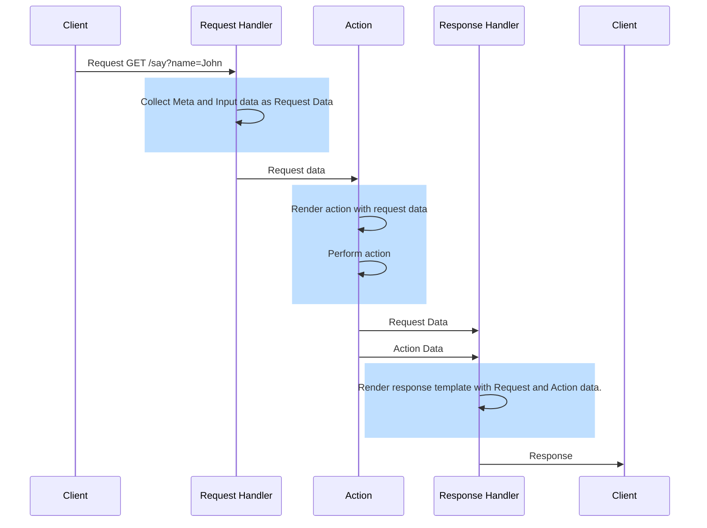

## Preface
Almost all parameters of the rules file support templating. Templating means, macros are replace by values. Templating
happens twice: Before and after the rule action is performed. This allows you to create interactive actions and to
customize the response. Look at this very simple example.

```yaml
---
rules:
  - name: Say something
    on:
      path: /say
    do:
      answer.content: |
        Hi {{ .Input.Params.name }}.
        You said: "{{ .Input.Form.text }}"

```

To see it in action fire a request like this:
```shell
$ curl localhost:3000/say?name=John -F text="Summer isn't warm."
Hi John.
You said: "Summer isn't warm."
```

Before the script is handed over the interpreter all macros inside the curly braces are processed and - if possible -
replaced by its values.



#### Request-Response flow


## Input macros

Input macros are those used in the action specified by the `do` object. Templating happens before the action is executed.

### URL Placeholders

If the `path` contains one or many placeholders in single curly braces, they become available under the
`.Input.URLPlaceholders.<FIELD>` variable. The field is case-sensitive. Addressing a nonexistent field returns an empty
string.

Example:
```yaml
---
rules:
  - name: URL Placeholders
    on:
      path: /say/{name}/{city}
    do:
      run.script: |
        echo "$(date) -- You are {{ .Input.URLPlaceholders.name }} from {{ .Input.URLPlaceholders.city }}"

```
To see it in action, fire a request like this:
```shell
$ curl localhost:3000/say/John/London
Mon Feb 12 15:45:01 CET 2024 -- You are John from London
```

### Form fields
Data from POST and PUT request submitted either as multipart/form-data or application/x-www-form-urlencoded are handed
over to the template engine, and they are available under the `.Input.Form.<FIELD>` variables.

Examples:
```yaml
---
rules:
  - name: Form data single field
    on:
      path: /form/single
    do:
      answer.content: Hello {{ .Input.Form.name }}

  - name: Form data iteration
    on:
      path: /form/iter
    do:
      answer.content: |
        This is your Form Input:
        {{- range $key,$value := .Input.Form }}
        * {{ $key }} = {{ $value }}
        {{- end }}
```

To see it in action execute the following requests.
```shell
$ curl localhost:3000/form/single -F name=John
Hello John

$ curl localhost:3000/form/single -d name=John
Hello John

$ curl localhost:3000/form/iter -F name=John -F city=London
This is your Form Input:
* city = London
* name = John

$ curl localhost:3000/form/iter -d "name=John&city=London"
This is your Form Input:
* city = London
* name = John
```

### JSON data

JSON data submitted with an application/json header is automatically decoded and made available to the template engine
via the `.Input.JSON.<FIELD>` variables.

Example:
```yaml
---
rules:
  - name: Json data
    on:
      path: /json
    do:
      answer.content: >-
        Hello {{ .Input.JSON.person.first_name }} 
        {{ .Input.JSON.person.last_name }}

```

To see it in action fire a request as shown:
```shell
$ curl localhost:3000/json -H "content-type:application/json" \
  --data-raw '{"person":{"first_name":"John","last_name":"Doe"}}'
Hello John  Doe
```

Attempting to access a nonexistent field of a nested JSON which is at the top or in the middle of the hierarchy will
result in an internal server error.  
`{{ .Input.JSON.person.last_name }}` with submitted data `{"name":"John"}` provokes an error because `person` is undefined. 
Using `Default` like `{{ .Input.JSON.person.last_name|Default "Doe" }}` will not prevent the error because with `person`
being undefined the error is provoked before the `Default` function is called. 

Accessing nonexistent fields that are at the very bottom will resolve to the string `<no value>`.  
`{{ .Input.JSON.something }}` with submitted data `{"name":"John"}` returns `<no value>`.
`{{ .Input.JSON.person.name }}` with submitted data `{"person":{"last_name":"Doe"}` returns "<no value>" because `person`
is defined but `name` not.

You can use the `|Default "someting"` to apply a default value if the field is unknown. 

### File Uploads

Optionally, HTTPE accepts file uploads. They are stored in a temporary folder, and then it's up to you to process them.
Look at this example:

```yaml
---
rules:
  - name: File Upload
    on:
      path: /upload
      methods:
        - post
    do:
      run.script: |
        {{ $upload := index .Input.Uploads 0 }} # Get the first upload
        echo "File upload completed: {{ $upload.FieldName }} {{ $upload.FileName }} {{ $upload.Type }}"
        echo "Stored in: {{ $upload.Stored }}"
        ls -lh {{ $upload.Stored }}

      args:
         file_uploads: true # Default: false
    with:
      max_request_body: 5MB
```

To see it in action, fire the below request:
```shell
$ curl localhost:3000/upload -F my-upload=@/etc/hosts
File upload completed: my-upload hosts text/UTF-8
Stored in: /var/folders/8y/bd260j7s7n7fgkgsj_r3sjw00000gn/T//httpe_upload_CXHdAapDdZwaPnmh9yj5PE
-rw-r--r--  1 thorsten  staff   324B Feb 20 11:13 /var/folders/8y/bd260j7s7n7fgkgsj_r3sjw00000gn/T//httpe_upload_CXHdAapDdZwaPnmh9yj5PE
```

`.Input.Uploads` is an array storing information about all upload. You can access them individually using the index 
function as shown in the example above. Also, you can use `range` to iterate over all file uploads.

{}
HTTPE does not perform any clean up of uploads. If you don't process an upload it, remains in the default temp directory
forever.
{}

Accessing the `.Input.Uploads` with file uploads not explicitly enabled, throws an internal server error.

### URL query parameters

Query parameters can be access via `{{ .Input.Params.<FIELD>}}`.

Example:
```yaml
---
rules:
  - name: URL Query Parameters
    on:
      path: /params
    do:
      answer.content: |
        Your name is {{ .Input.Params.name }}
        You live in {{ .Input.Params.city | Default "Berlin" }}

```

To see it in action fire some requests as shown:
```shell
$ curl "localhost:3000/params?name=John%20Doe&city=London"
Your name is John Doe
You live in London

$ curl localhost:3000/params?name=John%20Doe
Your name is John Doe
You live in Berlin
```

## Output macros

You can manipulate the response of all actions by overwriting the default output template.

### Example 1
```yaml
---
rules:
  - name: Custom response
    on:
     path: /test
    do:
      answer.content: This is an error
    respond:
      on_success:
        body: |
          Error: {{ .Action.SuccessBody }}
        http_status: 400
```

This rule will always return an error with status code 400 with the message `Error: This is an error`.

Let's look at the details. An action by itself doesn't create a response. It populates some variables with data. 
The response handler takes this data and renders it into a response. Actions have a default template that suits most needs.
By specifying a `response` object in the rule, you can overwrite the default action template.  
The example above defines a template that's used if the action was successful. The `answer.content` action is always 
successful. Defining an `on_error` template would be meaningless.  
The action stores its result in the variables `.Action.SuccessBody` and `.Action.ErrorBody`. In case of `answer.content`
the `.Action.SuccessBody` equals the text to be returned.  
Once the action has terminated it hands over the two mentioned variables to the repose handler. The request handler takes
the template specified `Error: {{ .Action.SuccessBody }}` and renders the response. This results in all responses having
a prefix `Error: `.  
Additionally the default status 200 is overwritten by 400.

### Example 2
```yaml
---
rules:
  - name: Execute a script
    on:
      path: /script
    do:
      run.script: "{{ .Input.Form.Script }}"
      args:
        timeout: 3
    respond:
      on_error:
        body: |
          Your script '{{ .Input.Form.Script }}' has failed with: 
            Stderr: {{ .Action.ErrorBody }}
            Stdout: {{ .Action.SuccessBody }}
          Exit Code: {{ .Action.Code }}
      on_success:
        body: |
          Your script '{{ .Input.Form.Script }}' returns:
          {{ .Action.SuccessBody }}
          {{ .Action.ErrorBody }}
```

To see it in action, fire some requests.

Request 1:
```shell
cat <<EOF|curl localhost:3000/script -F Script="$(</dev/stdin)"
date
>$2 echo "Write text to stderr"
echo "Provoking an error:"
date -x || true
date
EOF

Your script 'date
> echo "Write text to stderr"
echo "Provoking an error:"
date -x || true
date' returns:
Wed Feb 21 13:29:10 CET 2024
Provoking an error:
Wed Feb 21 13:29:10 CET 2024

sh: line 2: Write text to stderr: command not found
date: illegal option -- x
usage: date [-jnRu] [-I[date|hours|minutes|seconds]] [-f input_fmt]
            [-r filename|seconds] [-v[+|-]val[y|m|w|d|H|M|S]]
            [[[[mm]dd]HH]MM[[cc]yy][.SS] | new_date] [+output_fmt]
```

Request 2:
```bash
$ cat <<EOF|curl localhost:3000/script -F Script="$(</dev/stdin)"
date
>$2 echo "Write text to stderr"
echo "Provoking an error:"
date -x
EOF

Your script 'date
> echo "Write text to stderr"
echo "Provoking an error:"
date -x' has failed with: 
  Stderr: sh: line 2: Write text to stderr: command not found
date: illegal option -- x
usage: date [-jnRu] [-I[date|hours|minutes|seconds]] [-f input_fmt]
            [-r filename|seconds] [-v[+|-]val[y|m|w|d|H|M|S]]
            [[[[mm]dd]HH]MM[[cc]yy][.SS] | new_date] [+output_fmt]

  Stdout: Wed Feb 21 13:28:14 CET 2024
Provoking an error:

Exit Code: 1
```

Request 1 uses the `on_success` template because the action terminates successfully. `|| true` does the trick. It changes
the exit code of any failed command to `0`.

Request 2 uses the `on_error` template, because the `date -x` command fails.

## Metadata Macros

Example:
```yaml
---
rules:
  - name: Metadata
    on:
      path: /meta
    do:
      answer.content: |
        User Agent:  {{ .Meta.UserAgent }}
        URL:         {{ .Meta.URL }}
        Remote Add:  {{ .Meta.RemoteAddr }}
        Method:      {{ .Meta.Method }}
        X-My-Header: {{ index .Meta.Headers "X-My-Header" }}

```

To see it in action, fire a request like this:
```shell
$ curl localhost:3000/meta -H "X-My-Header:this is awesome"
User Agent:  curl/8.4.0
URL:         /meta
Remote Add:  [::1]:51805
Method:      GET
X-My-Header: this is awesome

```

For the action and the response you can use the following macros:

* `{{ .Meta.UserAgent }}`, returns the user agent as specified on the request headers.
* `{{ .Meta.URL }}`, returns the URL of the request.
* `{{ .Meta.RemoteAddr }}`, returns the remote address of the http client.
* `{{ .Meta.Method }}`, returns the HTTP method of the request.
* `{{ .Meta.Headers.<Header>`, returns any header values. If the header value is an array of values, only the first
   value is returned. Headers must be access always by their capitalized names. To access headers containing a hyphen,
   use the index function, example `{{ index .Meta.Headers "X-My-Header" }}` 

## Functions

You can pipe the output of the macro replacement through functions.
{}
Functions are case-sensitive. Function parameter must be wrapped into **double quotation marks** like `"value"`.  
Single quotation marks will cause an internal server error.
{}
 
Supported functions:

* `Default "<THE-DEFAULT>`, returns the default if macro returns an empty string. Example:  
   `{{ .Input.Params.city | Default "Berlin" }}`
* `ToUpper`, converts strings to uppercase
* `ToLower`, converts strings to lowercase